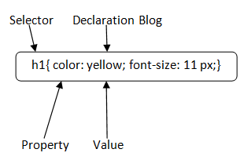

## CSS 1

### CSS Syntax

CSS syntax :

* `Selector` : Define who is targeted, wich HTML elements.
* `Property` : Defines what charateristic to alter.
* `Value` : Defines how to alter that charateristic.
* `Declaration` : Contaions property and value, separated by semicolon inside declaration block. 



```html
<p>Hello World!</p>
```

```css
p {
    color: red;
    text-align: center;
} 
```