# HTML 1

## **HTML (HyperText Markup Language)**

HTML is the skeleton of the website. Usually have `.html` file extension. It structures the content, but not the style or functionality. That's why later we will need CSS and JavaScript.

## **Anatomy of HTML Element**

<p style="text-align:center;">
  

Elements are surrounded opening and closing tags.

Attributes act like extra information tied to an HTML element. They are written within an HTML tag. As such, they are not displayed by the browser either.

Example :

```html
<a href="https://www.google.com">Have you googled it?</a>
```

### Self Enclosing Element

Some of html elements dont have closing tag and can’t contain anything inside them, but you can add a few attributes to provide them with additional information.

```html

<input type="text">
```

## **Valid HTML Structure**

[CodePen](https://codepen.io/impatbyte-network/pen/WaVZWO)

The HTML file requires specific structure to be valid. This is the example of simple and valid HTML document :

```html
<!DOCTYPE html>
<html>
  <head>
    <meta charset="utf-8">
    <title>MarkSheet</title>
    <meta name="description" content="A simple HTML and CSS tutorial">
  </head>
  <body>
    <p>Hello World!</p>
  </body>
</html>
```

- `<!DOCTYPE html>` : Tell the browser that the HTML document is an HTML 5.
- `<html>` : The ancestor of all HTML elements.
- `<head>` : carries additional information for the whole webpage, such as `<title>` and `<meta>`.
- `<title>` : The Title of HTML page.
- `<meta>` : A set of data that describes and gives information about the HTML document.

## **HTML Block vs Inline Element**

[CodePen](https://codepen.io/impatbyte-network/pen/JmgrqV)

Every HTML element has a default display value. The default display value for most elements is block or inline.

<p style="text-align:center;">
  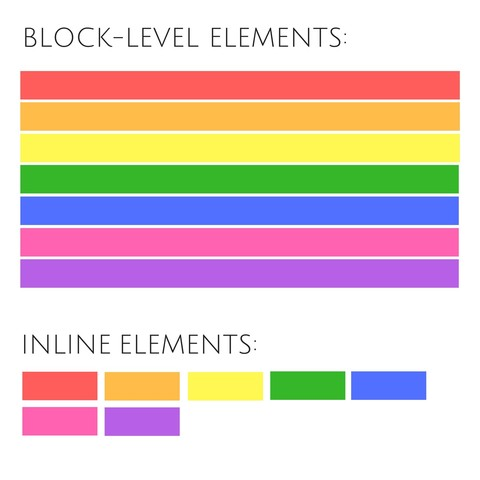

An inline element only takes up as much width as necessary. Examples :

- Span `<span>`
- Image ``
- Bold `<b>` or `<strong>`
- Italic `<i>`
- Quote `<q>`

A block element always takes up the full width available. Examples :

- Heading `<h1>` to `<h6>`
- Blockquote `<blockquote>`
- Paragraph `<p>`
- Article `<article>`

Code Example :

```html
<article>
  <h1>Famous football quotes</h1>
  <p>
    Sir <strong>Alex Ferguson</strong> once said about Filipo Inzaghi:<q>"That lad must have been born offside"</q>.
  </p>
</article>
```

Result :

<p style="text-align:center;">
  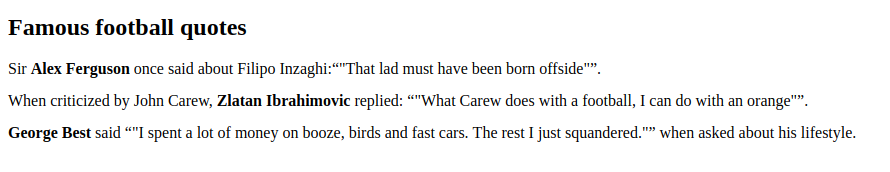

## **HTML Text Formatting**

### Paragraph

[CodePen](https://codepen.io/impatbyte-network/pen/dgxJRZ)

In HTML, each paragraph has to be wrapped by `<p>` element.

```html
<p>A paragraph is a unit of writing in a larger body of work. A paragraph expresses a particular topic or theme</p>
```

HTML also provide many elements for inline text formating like :

- `<b>`/`<strong>` : Bold text / Important text
- `<i>` : Italic text
- `<em>` : Emphasized text
- `<del>` : Deleted text
- `<abbr>` : Abbreviations text

```html
<article>
  <h1>Famous football quotes</h1>
  <p>
    Sir <strong>Alex Ferguson</strong> manager of <abbr title="Manchester United">MU</abbr> once said about <i>Filipo Inzaghi :</i><q>That lad must have been born <del>offside</del></q>.
  </p>
</article>
```

### List

[CodePen](https://codepen.io/impatbyte-network/pen/zmgpdK)

HTML provide three ways to specifying list of information :

- `<ul>` : unordered lists (using dots)

```html
<p>Starbucks Menu List:</p>
<ul>
  <li>Caramel Macchiato</li>
  <li>Caffe Latte</li>
  <li>Green Tea Cream</li>
</ul>
```

<p style="text-align:center;">
  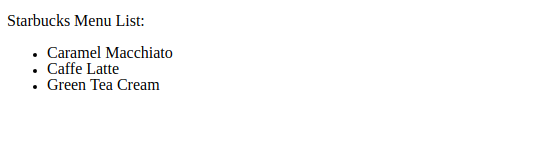

- `<ol>` : ordered lists (automatically numbered)

```html
<p>Starbucks Menu List:</p>
<ol>
  <li>Caramel Macchiato</li>
  <li>Caffe Latte</li>
  <li>Green Tea Cream</li>
</ol>
```

<p style="text-align:center;">
  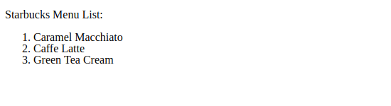

- `<dl>` : definition lists (pair of `<dt>` definition terms and `<dd>` definition descriptions)

```html
<p>Starbucks Menu List:</p>
<dl>
  <dt>Caramel Macchiato</dt>
  <dd>Freshly steamed milk with vanilla-flavored syrup is marked with espresso and topped with caramel drizzle for an oh-so-sweet finish.</dd>
  <dt>Caffe Latte</dt>
  <dd>Dark, rich espresso balanced with steamed milk and a light layer of foam. A perfect milk forward warm up.</dd>
  <dt>Green Tea Cream</dt>
  <dd>The mix of sweetened premium matcha green tea, milk and ice and top it with sweetened whipped cream to give you a delicious boost of energy.</dd>
</dl>
```

<p style="text-align:center;">
  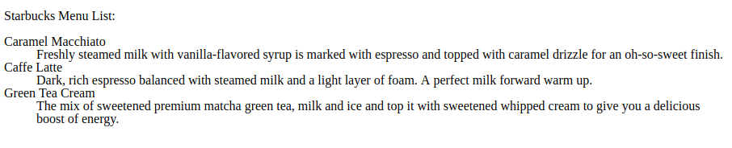

### Headings

[CodePen](https://codepen.io/impatbyte-network/pen/pxMpdv)

HTML defines 6 levels of heading (from `<h1>` to `<h6>`). The `<h1>` is the most important one.

```html
<h1>Heading 1</h1>
<h2>Heading 2</h2>
<h3>Heading 3</h3>
<h4>Heading 4</h4>
<h5>Heading 5</h5>
<h6>Heading 6</h6>
```

<p style="text-align:center;">
  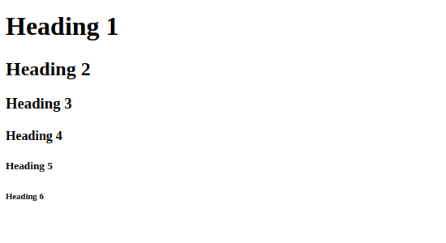

## **HTML Link**

[CodePen](https://codepen.io/impatbyte-network/pen/QZeaBW)

With HTML link you can jump to another document. There are three type of HTML Link usage:

- Navigate within the same page.
- Navigate within the same website.
- Navigate to another website.

### Navigate within the same page

By prepending your href with #, you can target an HTML element with a specific id attribute.

```html
<a href="#C2">Jump to Chapter 4</a>

<h2>Chapter 1</h2>
<p>Chapter 1 detail</p>

<h2 id="C2">Chapter 2</h2>
<p>Chapter 2 detail</p>
```

### Navigate within the same website

```html
Go to the <a href="./contact.html">contact page</a>.
```

### Navigate to another website

```html
<a href="https://www.google.com">Google</a>
```

## **HTML Images**

[CodePen](https://codepen.io/impatbyte-network/pen/wYVpYL)

Using `` tag, you can display non-textual content on the web. Like `.jpg`, `.gif`, `.png` format. The `` tag is a self closing element.

Folder Structure :

```
├── image
│   └── impact-byte-logo.png
└── index.html
```

In index.html file :

```html
Impact Byte Logo<br>

```

Result :

<p style="text-align:center;">
  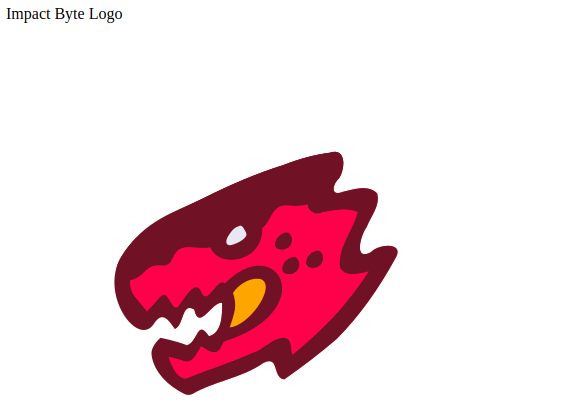

### Image Width, Height, and Style

We can specify image's height and with using `width`, `height`, or `style` attribute inside `` tag.

```html
Impact Byte Logo<br>

<br>

```

<p style="text-align:center;">
  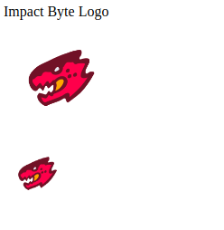

## **HTML Tables**

[CodePen](https://codepen.io/impatbyte-network/pen/dgxJQe)

To build HTML Table, we need several HTML tag souch as:

- `<table>` : Create Table
- `<tr>` : Add table row
- `<th>` : Add heding cell inside row
- `<td>` : Add regular cell inside row

Simple HTML table example :

```html
<table>
  <tr>
    <th>Name</th>
    <th>Instrument</th>
  </tr>
  <tr>
    <td>John Lennon</td>
    <td>Rhythm Guitar</td>
  </tr>
  <tr>
    <td>Paul McCartney</td>
    <td>Bass</td>
  </tr>
  <tr>
    <td>George Harrison</td>
    <td>Lead Guitar</td>
  </tr>
  <tr>
    <td>Ringo Starr</td>
    <td>Drums</td>
  </tr>
</table>
```

<p style="text-align:center;">
  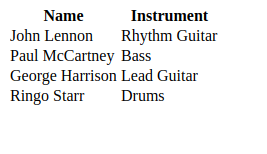

### Using `thead`, `tfoot`, and `tbody`

The `<thead>`, `<tfoot>` and `<tbody>` are collections of rows. The `<tbody>` tag is used to group the body content in an HTML table and `<thead>` / `<tfoot>` are used as a summary of the columns.

```html
<table>
  <thead>
    <tr>
      <th>Name</th>
      <th>Instrument</th>
    </tr>
  </thead>
  <tfoot>
    <tr>
      <th>Total</th>
      <th>4 Members</th>
    </tr>
  </tfoot>
  <tbody>
    <tr>
      <td>John Lennon</td>
      <td>Rhythm Guitar</td>
    </tr>
    <tr>
      <td>Paul McCartney</td>
      <td>Bass</td>
    </tr>
    <tr>
      <td>George Harrison</td>
      <td>Lead Guitar</td>
    </tr>
    <tr>
      <td>Ringo Starr</td>
      <td>Drums</td>
    </tr>
  </tbody>
</table>
```

<p style="text-align:center;">
  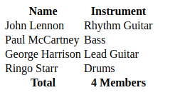

## **HTML Forms**

[CodePen](https://codepen.io/impatbyte-network/pen/MPNrRj)

The `<form>` tag is a block-level element that defines a form for user's input. The `<form>` tag require two attribute :

- `action` : contains an address that defines where the form information will be sent
- `method` : can be either GET or POST and defines how the form information will be sent

```html
<form action="./login.html" method="GET">
  Username :
  <input type="text" name="username">
  <button type="submit">Submit</button>
</form>
```

### Form control

To handle user input, HTML provide various form control souch as :

- text inputs (for one or multiple lines) `<input>`
- radio buttons `<input type="radio">`
- checkboxes `<input type="checkbox">`
- dropdowns `<select><option>Dog</option><option>Cat</option></select>`
- upload widgets `<input type="file">`
- submit buttons `<input type="submit">`

### Text input

| Input Type              | Description                                            |
| ----------------------- | ------------------------------------------------------ |
| `type="text"`           | Allows any type of character                           |
| `type="email"`          | Might display a warning if an invalid email is entered |
| `type="password"`       | Shows dots as characters                               |
| `type="number"`         | Up/Down keyboard keys can be used                      |
| `type="tel"`            | Can trigger an autofill                                |
| `<textarea></textarea>` | Can be resized                                         |

```html
<form action="./login.html" method="GET">
    Text : <input type="text"><br>
    Email : <input type="email"><br>
    Password : <input type="password"><br>
    Number : <input type="number"><br>
    Telephone : <input type="tel"><br>
    Long Text : <textarea></textarea><br>
    <button type="submit">Submit</button>
</form>
```

<p style="text-align:center;">
  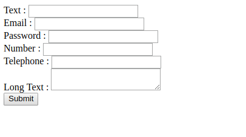

### Radio buttons

```html
<form action="./home.html" method="GET">
  Gender : <br>
  <input type="radio" name="gender" value="male" checked> Male<br>
  <input type="radio" name="gender" value="female"> Female<br>
  <input type="radio" name="gender" value="other"> Other
</form>
```

References :

- https://developer.mozilla.org/en-US/docs/Learn/HTML
- https://marksheet.io/html-basics.html
- https://www.w3schools.com/Html
